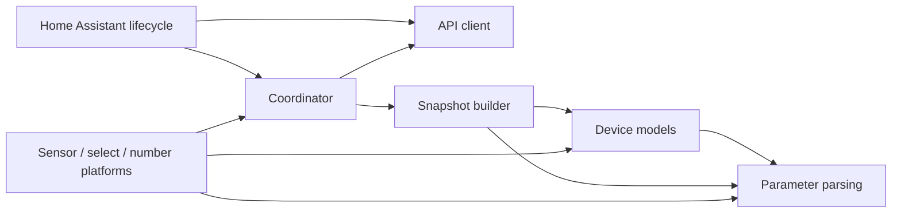

# Integration architecture

This document describes how the Plum ecoVENT integration is organized, how data moves through it, and where new behavior belongs. For supported entities and end-user setup, see the [README](../README.md). For the development workflow, see [CONTRIBUTING.md](../CONTRIBUTING.md). For the observed local HTTP protocol, see [econet-local-api.md](econet-local-api.md).

## Design goals

- Keep Home Assistant lifecycle code separate from ecoNET protocol parsing.
- Publish one coherent, validated device snapshot per coordinator refresh.
- Validate every writable parameter by both its protocol name and numeric id.
- Keep entity modules declarative: they present coordinator state and delegate writes without reparsing raw payloads.
- Contain transport, authentication, and insecure-HTTP policy in the API client.

## Package map

```text
custom_components/plum_ecovent/
|-- __init__.py             Config-entry setup, platform forwarding, unload
|-- api.py                  Async LAN HTTP client and endpoint contract
|-- config_flow.py          Initial setup and credential reauthentication
|-- coordinator/            Poll scheduling and atomic snapshot publication
|   |-- update.py           DataUpdateCoordinator and runtime UID validation
|   `-- snapshot.py         Snapshot model, indexes, and derived state assembly
|-- models/                 ecoNET-specific modes, presets, and status models
|-- parameters/             Generic payload parsing and parameter validation
|   |-- edit.py             editParams indexing and name/id/edit validation
|   |-- mapped.py           Integer-wire enum resolution
|   |-- number.py           Writable and read-only numeric resolution
|   |-- numeric.py          Finite-number parsing
|   `-- wire.py             Wire enum base and Unsupported option mapping
|-- entity.py               Shared coordinator entity base
|-- pending_write.py        Temporary optimistic state after successful writes
|-- sensor/                 Sensor platform and sensor entity families
|-- select/                 Select platform and writable mode entities
|-- number/                 Number platform and writable numeric entities
|-- diagnostics.py          Redacted config-entry diagnostics
|-- const.py                Domain, protocol names/ids, and shared constants
`-- translations/           Home Assistant UI translations
```

The root package contains Home Assistant entrypoints and genuinely cross-cutting services. Device semantics belong in `models/`; reusable parsing and parameter identity checks belong in `parameters/`; device identity validation belongs in `coordinator/`; entity presentation belongs in its Home Assistant platform package.

## Dependency direction

Dependencies point inward from Home Assistant presentation toward validated device data:



`parameters/` does not depend on coordinator or entity code. `models/` may use parameter helpers and shared constants, but does not depend on Home Assistant platform implementations. The coordinator owns the API client, combines its payloads with model resolvers, and exposes the write boundary. Platforms consume published snapshots and send writes through the coordinator; they do not access transport directly.

## Setup and polling flow

1. `config_flow.py` validates the supplied host and credentials through `PlumEconetApi.async_get_sys_params()` and records the module `uid` as the config-entry unique id. Reauthentication must return that same uid.
2. `__init__.py` creates the API client and `PlumEconetCoordinator`, performs the first refresh, and forwards setup to the sensor, select, and number platforms.
3. `coordinator/update.py` fetches `sysParams`, `regParams`, and `editParams`. It validates the runtime uid before accepting data from the configured host.
4. `coordinator/snapshot.py` indexes `editParams.data` once and resolves every mode, status, number, and countdown before constructing `PlumEconetData`.
5. The coordinator publishes the new snapshot only after the entire cycle succeeds. A failed endpoint or validation keeps the previous snapshot.
6. Entity properties read precomputed statuses from the coordinator; they do not independently interpret the raw payloads.

## Write flow

```mermaid
sequenceDiagram
    participant HA as Home Assistant
    participant Entity as Select/number entity
    participant API as PlumEconetApi
    participant Device as ecoNET module
    participant Coordinator

    HA->>Entity: set value
    Entity->>Coordinator: set parameter id and wire/value
    Coordinator->>API: newParam(id, wire/value)
    API->>Device: authenticated HTTP request
    Device-->>API: result = OK
    API-->>Coordinator: success
    Coordinator-->>Entity: success
    Entity->>Entity: record pending-write overlay
    Entity->>Coordinator: request refresh
    Coordinator->>API: poll current payloads
    API->>Device: authenticated HTTP requests
    Device-->>API: current payloads
    API-->>Coordinator: current payloads
    Coordinator-->>Entity: confirmed snapshot or overlay timeout
```



Before a write, the current snapshot must resolve the expected parameter name to its fixed numeric id and confirm that the entry is editable. Selects send the protocol wire value; numbers send the validated numeric value. A successful write temporarily overlays the requested state while older device snapshots catch up, then clears when the device confirms it or the timeout expires.

## Core invariants

- **Device identity:** the `sysParams.uid` must exist and match the config entry on every refresh and during reauthentication.
- **Atomic state:** entities observe either the previous complete snapshot or the next complete snapshot, never a mixture of endpoint generations.
- **Parameter identity:** writable entries require matching name, numeric id, editability, and `currNumbers` identity when supplied by the module.
- **Unavailable over guessed:** malformed, missing, non-finite, or mismatched values resolve to an invalid status and therefore an unavailable entity.
- **Transport policy:** cleartext HTTP requires explicit opt-in, credentials stay inside the API client, and redirects to insecure destinations are rejected.
- **One parsing site:** raw payload interpretation belongs in `parameters/` or an ecoNET-specific resolver in `models/`, not in entity state properties.

## Adding integration behavior

Choose the narrowest layer that owns the new concern:

1. Add protocol names and fixed ids to `const.py`.
2. Add generic parsing only when it is reusable across device features; place it in `parameters/`.
3. Add the ecoNET-specific spec, enum, status, or resolver to `models/`.
4. Include derived state in `coordinator/snapshot.py` when several entities use it or when it must be consistent across one refresh.
5. Add the Home Assistant description/entity to `sensor/`, `select/`, or `number/` and keep its state lookup thin.
6. Test raw-payload validation at the resolver boundary and observable entity behavior through a mocked API/config entry. Never contact real hardware.
7. Update the README and changelog when Home Assistant users can observe the new behavior.

## Error ownership

- `api.py` translates HTTP, authentication, response-shape, and transport failures into integration exceptions.
- `config_flow.py` translates those exceptions into form errors and reauth results.
- `coordinator/update.py` translates authentication failures into `ConfigEntryAuthFailed` and other client failures into `UpdateFailed`.
- Parameter and model resolvers return invalid status objects for malformed or inconsistent device data; they do not perform I/O or log polling warnings.
- The coordinator owns transition-aware warnings, such as newly observed unsupported enum wires.
